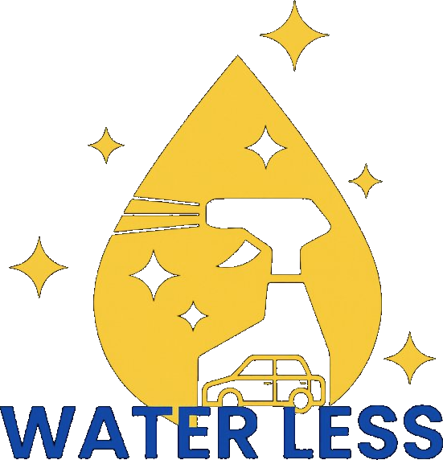

<!DOCTYPE html>
<html lang="fr">
<head>
<meta charset="utf-8">
<meta name="viewport" content="width=device-width, initial-scale=1.0">
<title>WATERLESS — Détailing sans eau à domicile</title>

</head>
<body>

<nav>
  

    <a href="#">Services</a>
    <a href="#">Comment ça marche</a>
  

  

    
  

  

    <a href="#">Avis</a>
    <a href="#">Mon compte</a>
  

</nav>

<section class="hero">
  

  

  

  

    

      
 Haute-Corse · À domicile

      <h1 class="hero-title">
        DETAILING 
        SANS EAU. 
        CHEZ TOI.
      </h1>
      
On vient chez toi. On repart. Ta voiture, ta moto ou ton bateau ressort comme neuve — sans une goutte d'eau, sans que tu bouges.

      

        <button class="btn-primary">PRENDRE RDV</button>
        <button class="btn-ghost">VOIR LES SERVICES</button>
      

      

        

200+

Clients

        

4.9★

Google

        

0L

D'eau

        

50%

Crédit impôt

      

    

    

      
Nos prestations

      

        
🚗

        

Voiture

Extérieur · Intérieur · Vitres · Jantes

        
Dès 49€

      

      

        
🏍️

        

Moto

Carénages · Cadre · Roues

        
Dès 39€

      

      

        
⛵

        

Bateau

Coque · Pont · Cockpit · Au port

        
Sur devis

      

      

        
💛

        

          
Crédit d'impôt 50%

          
Tu récupères la moitié sur ta déclaration

        

      

    

  

</section>

</body>
</html>
